--- 
title: "Foundational Data Science"
author: "Colin Gillespie"
site: bookdown::bookdown_site
output: bookdown::gitbook
documentclass: book
bibliography: [book.bib, packages.bib]
biblio-style: apalike
link-citations: yes
twitter-handle: csgillespie
description: "This course provides a firm foundation on the fundamentals of data science using R, with a focus on key statistical methods, exploratory data analysis, and visualizations. Before worrying about advanced analytics and neural nets, it is important to master the core skills. While this is certainly not a mathematical course, we won’t shy away from giving insight into the underlying mathematical theory."
github-repo: csgillespie/foundational-data-science
url: 'https\://csgillespie.github.io/foundational-data-science/'
---


This is still a work in progress. But pull requests and general comments are welcome.

# Author {-}

Colin Gillespie is the author of [Efficient R Programming](https://alexa.design/2pmfpf4), published by O'Reilly media. He is an Associate Professor of Statistics at Newcastle University, UK and regularly works with [Jumping Rivers](https://jumpingrivers.com) to provide data science training and consultancy. He is the only person in history to move to [Newcastle](https://en.wikipedia.org/wiki/Newcastle_upon_Tyne) for better weather.

#### Prerequisites {-}

We have tried to keep the prerequisites to a minimum; no calculus, no matrices, 
very little algebra. Throughout the book, we use the programming language [R](https://cran.r-project.org/) 
to illustrate techniques. However, we've tried to keep the programming style general, 
so translating into [Python](https://www.python.org/), should be straightforward.

<div class="rmdwarning">
<p>This document is in flux. Sections may appear/disappear.</p>
</div>


<!--chapter:end:index.Rmd-->


# Introduction {#chapter1}


<!-- (20 minutes) -->

> It is the mark of a truly intelligent person to be moved by statistics
> -- George Bernard Shaw

## Book overview

Data science is a vague term. While everyone can agree what a vet or a plumber does, an exact description of a data scientist is 
still elusive. My background is in statistics and I see data science as
the logical extension of applying statistical methods to large scale data sets.
However my colleague comes from a computer science background, and their take 
is switching that idea on it's head - large data sets first, analytics second. 
Both of us are correct _and_ also wrong. This explains why data scientists are 
in such demand. The problems they face are complex, challenging (and interesting) 
and require skills from multiple disciplines.

The goal of this short book is to provide an introduction into 
the wonderful world of data science from the statistical point of view. In 
a traditional statistics course^[Clearly there is some poetic licence here.], we would look at small, 
data sets to illustrate key concepts.
In a computing science course, we would start with a database and move on from there. This
book straddles both camps. Data sets that are small enough to be informative, but still 
have real world interest.

### The trouble with ~~tibbles~~ data

The trouble with interesting data, is that there are so many potential problems. 
For example, most real world data sets have missing data. However, there are different types of
missing data!

  * Missing completely at random (MCAR). This is the easiest to deal with. The data
  are missing independently of both observed and unobserved data. For example, if I ask you
  your age, and you flip a coin. If heads, you tell me the answer. If tails, you refuse.
 
  * Missing at random (MAR): given the observed data, data are missing independently of unobserved data.
  Example: Scottish participants are more likely to refuse a survey on soccer excellence,
  but it does not depend on the level of their soccer skills.

  * Missing not at random (MNAR): missing observations related to values of unobserved data.
  As a concrete example, a good predictor of whether someone survived the titanic disaster was whether or not they
  had their age recorded.

The key skills with data science are often being able to spot where potential issues lie. Once
we know the problems, we can formulate a strategy for overcoming them. Fortunately, 
there are a few standard tools available to help us.

When a data scientist confronts a new data set, they have a powerful arsenal of statistical
and machine learning algorithms at their disposal. However, before tackling a new data set, 
we should always explore and try to understand the issues before throwing the machine learning
[kitchen sink](https://en.wikipedia.org/wiki/Kitchen_sink_regression) at it.

This book targets people who work with data, but don't come from a mathematics
or statistics background. They know names of standard methods, but are a bit hazy on the
details. We aim to fill in some of the blanks. 
 
## Talking about data

The quantities measured in a study are called _random variables_ and a particular outcome is called an _observation_. A collection of observations is the _data_ (or _sample_). The collection of all possible outcomes is the _population_. If we were interested in how long a customer spends on our website, the time spent on a website
is our random variable. A particular customer's time would be an observation and if we recorded the time for
every person during the day, those times would be our data, which would form a _sample_ from the population of all customers.  As a shorthand we often use a capital letter (say $X$) to represent our random variable, and the lower case, with subscripts (e.g. $x_1$, $x_2$, $\ldots$, ), to represent observations _in a general sense_.

In practice it is difficult to observe whole populations, unless we are interested in a very limited population, e.g. just the customers who came to our website today.  In reality we usually observe a subset of the population, and this raises questions about who or what goes into our sample; we will briefly consider various commonly--used sampling techniques soon.  

Once we have our data, it is important to understand what _type_ it is -- so we can figure out exactly what to do with it.  The two main categories are _quantitative_ and _qualitative_ (in other words, numeric and non--numeric, respectively).  Quantitative data can be further subdivided into categories referred to as _discrete_ and _continuous_.  Discrete data moves in 'steps' -- for example, whole numbers, shoe sizes etc.  Continuous data can usually take _any_ value, although there may be restrictions to the set of positive numbers (for example height, weight) and there may be issues of accuracy depending on the equipment being used to record the data (and so sometimes continuous data might 'look' discrete!).  There are other words that are often used within these categories, such as 'ordinal', and 'categorical'.   

### Sample size

When considering data collection, it is important to ensure that the sample contains a sufficient
number of members of the population for adequate analysis to take place. Larger samples will
generally give more precise information about the population. Unfortunately, in reality, issues of
expense and time tend to limit the size of the sample it is possible to take. For example,
national opinion polls often rely on samples in the region of just $1,000$.

## Designing the experiment

Designing a suitable experimental isn't as easier you would first think. For example, 
let's suppose the two adverts were displayed on facebook. An initial idea would be 
to display advert 1 followed by advert 2. However, a number of _confounding_ factors
now become important. For example

 * Is traffic on facebook the same on each day, e.g. is Friday different from Saturday?
 * Is the week before Christmas the same as the week after Christmas?
 * Was your advert on the same page as a more popular advert?
 
The easiest way to circumvent these issues is with randomised sampling. Essentially,
instead of always display each advert, we display the advert with a probability. The
probability could be equal, or if you were trying a new and untested approach, you might have
probability $0.95$ standard advert, $0.05$ new advert.

## Data sets

During this course, we'll use a few different data sets to illustrate the key points. 
The datasets can be found in the [GitHub](https://github.com/jumpingrivers/foundational-data-science/tree/master/data) 
repository for this book.

### The relationship between beauty and teaching

This data set is from a [study](https://doi.org/10.3386/w9853) where researchers were 
interested in whether a lecturers' attractiveness affected 
their course evaluation! This is a cleaned version of the
data set and contains the following variables:

 * evaluation: the questionnaire result
 * tenured: does the lecturer have tenure; 1 == Yes. In R, this value is continuous.
 * minority: does the lecturer come from an ethnic minority (in the USA)
 * age: the lecturers' age
 * gender: a factor: Female or Male
 * students: number of students in the class
 * beauty: each of the lecturers' pictures was rated by six undergraduate students: three women and three men. 
 
The raters were told to use a 10 (highest) to 1 rating scale, to concentrate on the [physiognomy](https://en.wikipedia.org/wiki/Physiognomy) of the 
professor in the picture, to make their ratings independent of age, and to keep 5 in mind as an average. 
The scores were then normalised.


This data set has 463 rows and 7 columns.

### Bond, James Bond

This data set contains information about James bond movies. The data set contains 24 movies
with the following columns:

 * `Film`: the movie name.
 * `Actor`: the actor who played James Bond (to be clear, [Sean Connery](https://en.wikipedia.org/wiki/Sean_Connery) is clearly the best bond).
 * `Kills`: the number of kills by Bond.
 * `Relationships`: the number of romantic relationships by Bond.
 * `Alcohol_Units`: the number of Units of alcohol consumed by Bond.
 * `Alcohol`: a discretised version of `Alcohol_Units`.
 * `Nationality`: the nationality of the Bond actor.

__Credit__ Thanks to [Jack Prenter](http://www.knownman.com/james-bond-graph/) for
collecting this data.

### OKCupid

This data set was created using a python script to pull data from public profiles on [okcupid](www.okcupid.com). There are a total of 59946 profiles which includes people within a 25 mile radius of San Francisco, who were online between June 2011 and July 2012 and had at least one profile picture. Each user has 32 variables. 
The overall data set is around 150MB, while not "big", it is prohibitive for teaching. 
So we've dropped 11 variables relating to "users essays". This results in an uncompressed data set of around 12MB.

__Credit__: Data and code for OkCupid Profile Data for Introductory Statistics and Data Science Courses (Journal of Statistics Education July 2015, Volume 23, Number 2); [GitHub](https://github.com/rudeboybert/JSE_OkCupid) page.

### Starbucks

The Starbucks data set contains nutritional information on 113 products from Starbucks. 
The data set has six columns:

 * `Product`
 * `Calories`
 * `Fat`
 * `Carb` (Carbohydrates)
 * `Fiber`
 * `Protein`


<!--chapter:end:01-introduction.Rmd-->

---
knit: "bookdown::preview_chapter"
editor_options: 
  chunk_output_type: console
---


# Condensing data with numerical summaries {#chapter2}

> James Bond: [to Vesper] Why is it that people who can't take advice always insist on giving it? 

<!-- (90 minutes) -->

One of the roles of a data scientist is to condense large amounts of information
into a few key summaries. There are many possible choices when simplifying data
and it is certainly not the case that "one size fits all".
In this chapter, we will look at standard measures of location and spread, which are
the building blocks for many statistical and machine learning algorithms. We discover
that some measures fit naturally into a big data scenario while others do not.


## Mathematical notation

Before we can talk more about numerical techniques we first need to
define some basic notation. This will allow us to generalise all
situations with a simple shorthand.

Very often in statistics we replace actual numbers with letters in
order to be able to write general formulae. As discussed earlier, we generally use a single upper case letter to represent our random variable and the lower case to represent sample data, with subscripts to distinguish individual observations in the sample.  Amongst the most common letters to use is $x$, although $y$ and $z$ are frequently used as well. For
example, suppose we ask three people how many
mobile phone calls they made yesterday. We might get the following data: 1, 5, 7. If
we take another sample we will most likely get different data, say 2,
0, 3. Using algebra we can represent the general case as $x_1$, $x_2$,
$x_3$:

| | |
------------|--|---|---
1st sample: | 1 | 5 | 7
2nd sample: | 2 | 0 | 3 
$\vdots$  | $\vdots$ | $\vdots$ | $\vdots$ 
typical sample: | $x_1$ | $x_2$ | $x_3$

This can be generalised further by referring to the random variable _as a whole_ as
$X$ and the $i\text{th}$ observation in the sample as $x_i$. Hence, in
the first sample above, the second observation is $x_2=5$
whilst in the second sample it is $x_2=0$. The letters $i$ and $j$ are
most commonly used as the index numbers for the subscripts.

The total number of observations in a sample, that is the _sample size_, is usually referred to by the letter $n$.
Hence in our simple example above $n = 3$.

The next important piece of notation to introduce is the symbol
$\sum$. This is the upper case of the Greek letter $\sigma$, pronounced ''sigma''.  It is used
to represent the phrase 'sum the values'. This symbol is used as
follows
\[
\sum_{i=1}^n x_i = x_1 + x_2 + \dots + x_n.
\]
This notation is used to represent the sum of all the values in our
data (from the first $i = 1$ to the last $i = n$), and is often
abbreviated to $\sum x$ when we sum over all the data in our sample.

## Measures of location

These are also referred to as averages. In general
terms, they tell us the value of a "typical" observation. There are two measures which are
commonly used: the mean and the median. We will consider these in
turn. When these are obtained from a sample of data, rather than the entire population, we
often prefix with the word "sample".

### Sample mean

One of the most important and widely used measures of location is the (arithmetic) mean,
more commonly known as the average
\[
 \bar x = \frac{x_1 + x_2 + \ldots + x_n}{n} = \frac{1}{n} \sum_{i=1}^n x_i 
\]
where $x_i$ are our data points and $n$ is the sample size, i.e. the number of 
data points in our sample. So if our data set was $\{0,3,2,0\}$, then $n=4$. Hence,
\[
\bar x = \frac{1}{n} \sum_{i=1}^n x_i = \frac{0 + 3 + 2 + 0}{4} = 1.25 \;.
\] 
In statistics, it is common to use a potential bar over a variable to denote the 
mean.


<div class="rmdnote">
<p>Why do we say &quot;sample mean&quot; instead of just mean? In statistics we make the distinction between the population mean (the <em>true</em> value) and the estimate mean. To differentiate between the population and sample means, we use <span class="math inline"><em>μ</em></span> and <span class="math inline">$\bar x$</span> respectively.</p>
<p>Statistics uses the sample to inform us about the population.</p>
</div>

### Example: The beauty data set {-}

The `beauty` data set contains results for 463 classes. After loading 
the data set into R, we can extract a particular column using the dollar 
operator

```r
## Attractiveness score
beauty$beauty
## Number of students per class
beauty$students
```
We can use the built-in function `mean()` to calculate the
average attractiveness score and class size

```r
## Attractiveness score (normalised)
mean(beauty$beauty)
#> [1] -0.0883
## Number of students per class
mean(beauty$students)
#> [1] 55.2
```

### Sample median

The median is occasionally used instead of the mean, particularly when the data have an
asymmetric profile or when there are outliers (as indicated by graph, perhaps). The median is
the middle value of the observations when they are listed in ascending order. It is
straightforward to determine the median for small data sets. For larger data sets, the calculation
is more easily done using a computer package such as R.


Ranked observations are denoted as $x_{(1)}, x_{(2)}, \ldots, x_{(n)}$. The sample median is defined as:
\[
\text{Sample median} = 
\begin{cases}
  x_{(n+1)/2}, & n \text{ odd;} \\
  \frac{1}{2}x_{(n/2)} + \frac{1}{2} x_{(n/2+1)}, & n \text{ even}\;.
\end{cases}
\]

The median is less sensitive to outliers than the sample mean, but has less useful mathematical properties. 

For our simple data set $\{0, 3, 2, 0\}$, to calculate the median we
re-order it to: $\{0, 0, 2, 3\}$; then take the average of the middle two
observations, to get 1.

#### Example: The beauty data set {-}

R has a built-in function called `median()` that we can use to calculate sample median.
We'll use the same variables as previous

```r
median(beauty$beauty)
#> [1] -0.156
median(beauty$students)
#> [1] 29
```
Notice that the mean and median beauty scores are approximately the same; this implies that the data
are roughly symmetric. However the class size values differ: $\bar x = 55$ and the median is $29$. This
is because the class sizes are [skewed](https://en.wikipedia.org/wiki/Skewness); 
there are many more large values than smaller values.

<div class="rmdnote">
<p>The classic case of where it can be misleading to use the mean, is income. Here a few very rich individuals can dominate the statistic.</p>
</div>

## Measures of spread
<!-- (25 minutes) -->


A measure of location is insufficient in itself to summarise data as it only describes the value of a
typical outcome and not how much variation there is in the data. For example, the two datasets
10, 20, 30 and 19, 20, 21 both have the same mean (20) and the same median (20). However the
first set of data ranges considerably from this value while the second stays very close. They are
quite clearly very different data sets. The mean or the median does not fully represent the data.
There are three basic measures of spread which we will consider: the range, the inter–quartile
range and the sample variance/standard deviation.
  
### Range
  
The range is easy to calculate. It is simply the largest minus the
smallest.^[When you get a new data set, calculating the range is
    useful when checking for obvious data-input errors.]
\[
\text{Range }= x_{(n)} - x_{(1)} 
\]
where $x_{(n)}$ is the largest value in our data set and $x_{(1)}$ is the smallest value.
So for our data set of $\{0,3,2,0\}$, the range is $3-0=3$. It is very useful
for data checking purposes, but in general it's not very robust. 

There are two problems with the range as a measure of spread. When calculating the range you
are looking at the two most extreme points in the data, and hence the value of the range can be
unduly influenced by one particularly large or small value, known as an outlier. The second
problem is that the range is only really suitable for comparing (roughly) equally sized samples as
it is more likely that large samples contain the extreme values of a population.


#### Example: OKCupid {-}

Starting any analysis it's a good idea to calculate the range of the variables. 
It's a straightforward way of ensuring everything is correct.
For example, the range of ages in the OK Cupid data set
is

```r
range(cupid$age)
#> [1]  18 110
```
Perhaps a little on the high side?


### Sample variance and standard deviation
  
In statistics, the mean and variance are used most often. 
This is primarily because they have nice mathematical properties, unlike the median. 
The sample variance, $s^2$, is defined as
\[
s^2 = \frac{1}{n-1} \sum_{i=1}^n (x_i - \bar x)^2
\]
Essentially we are measuring the difference between the sample mean, $\bar x$,
and each observation in turn. By squaring the difference, we avoid positive and negative
values cancelling.

The formula can be rewritten as
\[
s^2= \frac{1}{(n-1)} \left\{ \left(\sum_{i=1}^n x_i^2\right) - n \bar x^2 \right\} \;.
\]
The second formula is easier for calculations.^[The divisor is $n-1$ rather than
  $n$ in order to correct for the bias which occurs because we are measuring
deviations from the sample mean rather than the ``true" mean of the population
  we are sampling from.] However $\sum x^2$ becomes very large as $n$ increases.
This could lead to a potential loss of precision, in practice we would 
use
\[
s^2= \sum_{i=1}^n \frac{x_i^2}{n-1}  - \left(\frac{n}{n-1}\right) \bar x^2  \;.
\]  
For our toy data set, $\{0,3,2,0\}$, we have
\[
\sum_{i=1}^4 x_i^2 = 0^2 + 3^2 + 2^2 + 0^2 = 13.
\]
So
\[
s^2 = \frac{1}{n-1} \left\{ \left(\sum_{i=1}^n x_i^2\right) - n \bar x^2
\right\} = \frac{1}{3} \left( 13 - 4 \times 1.25^2\right) = 2.25.
\]
The sample standard deviation, $s$, is the square root of the sample variance,
i.e. for our toy example $s = \sqrt{2.25} = 1.5$. The standard
deviation is preferred as a summary measure as it is in the same units as the
original data. However, it is often easier from a theoretical perspective to
work with variances.

A rule of thumb for getting a feel for your data, is that approximately 95% of data is contained
in the interval
\[
\bar x \pm 2 \times s
\]
We'll see in chapter \@ref(chapter4) the mathematical underpinning for this rule.

<div class="rmdnote">
<p>If this was a &quot;Maths class&quot;, we would spend some time discussing why we divide by <span class="math inline"><em>n</em> − 1</span> and not <span class="math inline"><em>n</em></span>. If we had access to all of the population, we would use <span class="math inline"><em>n</em></span>. However, we don't and to correct for that we use <span class="math inline"><em>n</em> − 1</span>.</p>
</div>

#### Example: R

R has built-in functions to calculate the standard deviation and variance respectively

```r
sd(beauty$evaluation)
#> [1] 0.555
var(beauty$evaluation)
#> [1] 0.308
```

### Quartiles and the interquartile range
  
The upper and lower quartiles are defined as follows:

  * $Q_1$: Lower quartile = ($n$+1)/4$^{\text{th}}$ smallest observation.
  * $Q_3$: Upper quartile = 3 ($n$+1)/4$^{\text{th}}$ smallest observation.

We can linearly interpolate between adjacent observations if necessary. The 
interquartile range is the difference between the third and first quartile, i.e.
\[
IQR = Q_3 - Q_1.
\]
Like the median, the IQR isn't influenced by large values (outliers). However it
is more computationally difficult to calculate.

### Numerical examples
  
For the following data sets, calculate the inter-quartile range:

1. $\{5, 6, 7, 8\}$ 

The lower quartile is the $5/4 = 1.25^{\text{th}}$ smallest
  observation, i.e. $x_{(1.25)}$. The value of $x_{(1)} = 5$ and $x_{(2)} = 6$. So the first quartile is one quarter of the way between $x_{(1)}$ and $x_{(2)}$, i.e a quarter of the way between 5 and 6,
  \[
  x_{(1.25)} = x_{(1)} + 0.25 \times (x_{(2)} - x_{(1)}) = 5 + \frac{6-5}{4} = 5.25.
  \]
  Similarly, the upper quartile is the $3 \times (4+1)/4 = 3.75^{\text{th}}$ smallest observation. So 
  \[
  x_{(3.75)}  = x_{(3)} + 0.75 \times (x_{(4)} - x_{(3)}) = 7.75.
  \]
  Therefore, 
  \[
  IQR = 7.75 - 5.25 = 2.5.
  \]
  
2. $\{10, 15, 20, 25, 50\}$. 

The lower quartile is the $(5+1)/4 = 1.5^{\text{th}}$ smallest
  observation, i.e. $x_{1.5}$, so
  \[
  x_{(1.5)} = x_{(1)} + 0.5 \times (x_{(2)} - x_{(1)}) = 12.5.
  \]
  Similarly, the upper quartile is the $3 \times (5+1)/4 = 4.5^{\text{th}}$ smallest observation. So 
  \[
  x_{(4.5)} = x_{(4)} + 0.5 \times (x_{(5)}-x_{(4)}) = 37.5.
  \]
  Thus,
  \[
  IQR = 37.5 - 12.5 = 15.
  \]
  
#### R example

The quartiles are special cases of percentiles: 

 * The minimum is the 0$^{th}$ percentile
 * $Q_1$ is the 25$^{th}$ percentile
 * The median, $Q_2$ is the 50$^{th}$ percentile
 * $Q_3$ is the 75$^{th}$ percentile
 * The maximum is the 100$^{th}$ percentile

The `quantile()` function calculate these values

```r
quantile(cupid$age)
#>   0%  25%  50%  75% 100% 
#>   18   26   30   37  110
```
The R function has also has a `probs` argument where we can specify our
own percentiles

```r
## The middle 90% 
quantile(cupid$age, probs = c(0.025, 0.975))
#>  2.5% 97.5% 
#>    20    58
# Rule of thumb
mean(cupid$age) - 2*sd(cupid$age)
#> [1] 13.4
mean(cupid$age) + 2*sd(cupid$age)
#> [1] 51.2
```

<div class="rmdtip">
<p>There are actually (at least) 9 different versions of how to calculate quantiles (see <code>?quantile</code> in R). The version described in these notes is <code>type = 6</code> in R. Typically, the quantiles give approximately the same answer.</p>
</div>

<!-- (25 minutes) -->

## Streaming data

Streaming data is data that is generated continuously by multiple sources. 
Developing algorithms for dealing with streaming data is an active area of research,
both statistically and computationally. Even though we've only covered a few statistics,
some of them can be easily adapted to deal with streaming data while others can't.

### The mean and variance

Suppose we have observed $k-1$ values and our current estimate of the mean is $m_{k-1}$.
A new observation, $x_k$ arrives. How would we update our estimate? 
An obvious method is
\[
m_k = \frac{(k-1) \times m_{k - 1} + x_k}{k}
\]
However this method isn't _numerically stable_. Basically $(k-1) \times m_{k - 1}$ can 
get large and we'll lose precision. Instead we should use
\[
m_k = m_{k-1} + \frac{x_k - m_{k-1}}{k}
\]
We have a similar algorithm for the variance
\[
v_k = v_{k-1} + (x_k - m_{k-1})(x_k - m_k)
\]
Again this algorithm is [numerically stable](https://en.wikipedia.org/wiki/Numerical_stability).

#### Example: R 

The OKCupid data set contains almost 60,000 individuals. Figure \@ref(fig:2-1)
plots the estimate of the mean age as we progress through the data set.
<div class="figure" style="text-align: center">
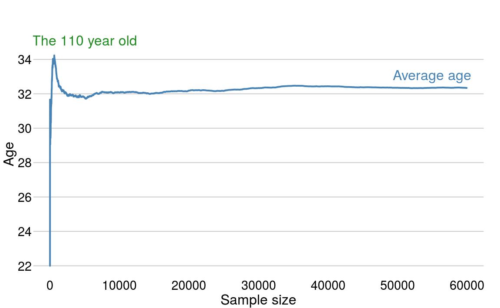
<p class="caption">(\#fig:2-1)The estimate of the mean age as we progress through the data set.</p>
</div>
After some variation in the first few observations, we quickly settle to a consistent
estimate of the mean. The spike up to age $34$ is due to the outlying age of $110$

### The median and quantiles

In contrast to the mean keeping a [running median](https://stackoverflow.com/q/10657503/203420)
is a non-trivial task. Essentially we need to maintain a sorted data structure containing 
the data. The key issues are storage cost of the data and retrieval time. 

## Relevant R functions {-}


Table: (\#tab:unnamed-chunk-19)Summary of R commands in this chapter.

Command    Comment                                         Example                 
---------  ----------------------------------------------  ------------------------
mean       Calculates the mean of a vector                 `mean(x)`               
sd         Calculates the standard deviation of a vector   `sd(x)`                 
var        Calculates the variance of a vector             `var(x)`                
quantile   The vector quartiles.                           `quantile(x, type = 6)` 
range      Calculates the vector range                     `range(x)`              

    

<!--chapter:end:02-summary-statistics.Rmd-->

---
knit: "bookdown::preview_chapter"
editor_options: 
  chunk_output_type: console
---


# What, why and how of visualisation {#chapter3}
<!-- (90 minutes) -->


> A picture paints a thousand words - _Frederick R. Barnard_

Data visualisation is an old topic; but in the last few years, it's become particularly trendy.
With the correct visualisation, we can highlight key features
that don't require any fancy statistics.

#### Prerequisites {-}

We could have an entire course on creating graphics, but in this chapter we'll concentrate 
on the fundamentals. To make this section concrete, we'll use the [**ggplot2**](http://ggplot2.tidyverse.org/)
package within R. However, there are many libraries available to generate the graphics
in other languages. For example, in Javascript we could use `d3`, or `seaborn` in python.

The **ggplot2** and **hrbrthemes** packages can be easily installed via

```r
install.packages(c("ggplot2", "hrbrthemes"))
```
and loaded in the usual way, e.g.

```r
library("ggplot2")
library("hrbrthemes")
```

## Historical visualisations 

John Snow^[Not [that](https://en.wikipedia.org/wiki/Jon_Snow_(character)) Jon Snow, he knows nothing.] 
created a simple dot map to illustrate the cluster of cholera cases around a water pump - figure \@ref(fig:3-1).
This allowed him to show the connection between the quality of the water source and cholera cases.
He was able to demonstrate that the Southwark and Vauxhall Waterworks Company was taking water from sewage-polluted sections of the Thames and delivering the water to home. 
Thereby leading to an increased incidence of cholera. This study is a major event in the history of public health and geography. It is regarded as the founding event of the science of epidemiology.

(ref:3-1) John Snow dot map of cholera cases (https://en.wikipedia.org/wiki/John_Snow).

<div class="figure" style="text-align: center">

<p class="caption">(\#fig:3-1)(ref:3-1)</p>
</div>

The Hereford Mappa Mundi dates from around 1300 - figure \@ref(fig:3-2). It is currently on display at Hereford Cathedral in [Hereford](https://goo.gl/maps/EQpxywNkjbB2), England. 
It is the largest medieval map known still to exist. At the centre of the map is Jerusalem,
in the bottom left is the UK, at the top is the garden of Eden (some of the data points are approximate!)

(ref:3-2) Hereford Mappa Mundi (https://en.wikipedia.org/wiki/Hereford_Mappa_Mundi).

<div class="figure" style="text-align: center">

<p class="caption">(\#fig:3-2)(ref:3-2)</p>
</div>

[Florence Nightingale](https://en.wikipedia.org/wiki/Florence_Nightingale) is described as "a true pioneer in the graphical representation of statistics". 
Her diagram about the causes of mortality in the army (figure \@ref(fig:3-3)), was ground breaking.
Florence's graph showed that sanitation was a major killer in the army. After 
successfully lobbying the government, the mortality rate dropped from 69 to 18 per 1000.

(ref:3-3) Diagram of the causes of mortality in the army in the East by [Florence Nightingale](https://en.wikipedia.org/wiki/Florence_Nightingale).

<div class="figure" style="text-align: center">

<p class="caption">(\#fig:3-3)(ref:3-3)</p>
</div>

Visualisation is incredibly important. Whenever I get a data set, I automatically 
start generating plots to get a feel for the data. It helps us to detect interesting
patterns in the data; remember plotting can save lives (if you're Florence Nightingale).


## Scatter plots

A scatter plot has horizontal and vertical axes to plot data points.
Typically they are used to show how one variables is affected by another. 
Let's start with a simple scatter plot of looking at whether
the Bond movies have become more violent over time. In ggplot, 
we first specify a _canvas_ and then add subsequent layers using the 
`+` operator

```r
ggplot(bond, aes(x = Number, y = Kills)) + # Create a canvas
  geom_point() # Add a layer of points
```

<div class="figure" style="text-align: center">

<p class="caption">(\#fig:3-4)Has Bond got more violent?</p>
</div>
On the $x$-axis we have the movie number (chronological movie order) and on 
the $y$-axis we have the number of kills made by Bond. The scatter plot
does show a general trend, with an increased number of deaths in latter movies.

Figure \@ref(fig:3-4) is OK, but could be significantly improved. 

<div class="rmdnote">
<p>There's a lot going on in the code used to generate the figure. The first argument is the data frame <code>bond</code>, while <code>aes</code> argument specifies what elements in the plot should change with a variable.</p>
</div>

First we'll use colour to differentiate between actors and fix the axis limits

```r
g = ggplot(bond, aes(x = Number, y = Kills)) + # Create a canvas
  geom_point(aes(colour = Actor)) + # Add a layer of points
  ylim(c(0, 50))  
g # With ggplot we can store the graph construct
```

<div class="figure" style="text-align: center">

<p class="caption">(\#fig:3-5)Using colour to differentiate between actors.</p>
</div>
By using colour, we can see that Pierce was a particularly violent Bond, with the green points
in the top right hand corner. 

Next we can add a trend line to get a feel for the relationship over time. 
The `stat_smooth()` layer adds a local trend line. Essentially, the line moves 
along the $x$-axis and the gradient is only affected by nearby points.

```r
g_smooth = g + stat_smooth(colour = "steelblue", se = FALSE, method = "loess")
g_smooth
```

<div class="figure" style="text-align: center">

<p class="caption">(\#fig:3-6)Capturing the trend.</p>
</div>
This graph now contains some useful insight.

1. The number of kills appears to be increasing with each bond movie.
2. Pierce Brosnan (the green points) liked killing people.
3. Daniel Craig's movies didn't contain (that) many deaths.


### Styling your plot

If the graph is only going to be consumed by the data scientist, then there
is no need to spend time polishing the final product. However if the graph 
is to be used to convince or highlight issues for other people, then some
time and effort needs to be spent. 

**ggplot2** has the concept of themes that can style the plot. Here we 
use the [hrbrthemes](https://github.com/hrbrmstr/hrbrthemes) package. It provides

> typography-centric themes and theme components for ggplot2

Basically, it's opinionated. The package enables us to change the background colour, tweak the palette
and add proper labels, with minimal effort

```r
library(hrbrthemes)
g_smooth + 
  theme_ipsum() + 
  scale_color_ipsum() +
  labs(x = "Movie number", 
       y = "No. of Bond Kills",
       title = "Kills through time",
       subtitle = "Is there a relationship?",
       caption = "Pierce wasn't a nice man!") 
```

<div class="figure" style="text-align: center">

<p class="caption">(\#fig:3-7)Pimping your graph with the hrbrthemes package.</p>
</div>
With little effort, we've gone from something basic - figure \@ref(fig:3-4) - to a high 
quality, publication ready figure, \@ref(fig:3-7). Unfortunately, 
we have limited time to spend on graph aesthetics.

#### Exercise / Q & A  {-}
<!-- (25 minutes) -->

  * Does alcohol consumption change through time?
  * Does there appear to a relationship between alcohol and the number of kills?
  * Change method from `smooth` to `lm`.

## Histograms

A histogram is a graphical representation of the distribution of continuous, numerical data.
If the area under the graph adds up to one, then it is a _probability_ distribution.
Constructing a histogram is straightforward; we divide the entire range into
a series of intervals and count how many values fall into each interval.
Bins do not have to be the same size (but they probably should be in general).

We'll start with a histogram of users ages from the OKCupid dataset. To 
create a histogram, we use the `geom_histogram()` function 

```r
ggplot(cupid, aes(x = age)) + 
  geom_histogram(binwidth = 1) 
```
This creates the left plot in figure \@ref(fig:3-8).

<div class="figure" style="text-align: center">

<p class="caption">(\#fig:3-8)Age distribution of the OKCupid data set.</p>
</div>
Notice in the code we've specified `binwidth = 1`. This means that the binwidth is equal
1 year. The default (in ggplot2) is to create a plot using 30 bins, it's always a good
idea to explore the effect of varying the binwidth. In particular, if you look carefully
at the plot where the `binwidth = 1`, we can see a spike at `age = 42`.
Another interesting feature is the long tail - this is an example of a _right skewed_ or _positively skewed_ data set.

Often we want to split a plot up by different variables, for example, the 
users `gender`. This is easy with **ggplot2**; we just add on an 
additional call to `facet_wrap()`


```r
ggplot(cupid, aes(x = age)) + 
  geom_histogram(binwidth = 1) + 
  facet_wrap(~ sex) + 
  coord_cartesian(xlim = c(18, 80))
```

<div class="figure" style="text-align: center">

<p class="caption">(\#fig:3-9)OKCupid age distribution by gender.</p>
</div>

By splitting age by gender, two interesting features become apparent from figure \@ref(fig:3-9)

1. There are many more male OK Cupid users than female (not surprising).
2. The general age distribution looks similar between sexes.
3. The most surprising aspect is that the spike in age 42 is due to female users. This
could be by pure chance, users lying about their age, or a mistake in data entry.

## Density plots

A downside of using a histogram, is that putting two histograms on top of each other
makes the graphic cluttered and unclear (of course you can use panels as above). 
An alternative method is to use a _kernel density estimator_. Essentially we draw a 
line around the histogram.


```r
ggplot(cupid, aes(x = age)) + 
  geom_density(aes(colour = sex)) +
  xlim(c(18, 80))
```

<div class="figure" style="text-align: center">

<p class="caption">(\#fig:3-10)Kernel density plots of the ages.</p>
</div>
Since the distributions are represented as lines, we can plot multiple 
distributions on top of each other. By plotting in this way, it becomes
obvious the distributions of each gender are similar. _However_, we have
smoothed over the bump at age 42.


### Detailed explanation

This section aims to give gentle introduction to how kernel density plots
are actually constructed. Behind the scenes, there's some nice mathematical 
theory the underpins this graph. However, we'll avoid the maths and concentrate
on the intuition. 

Suppose we have three points: (-2, -1, 2). These points are shown in figure \@ref(fig:3-11) (a) as blue crosses. 
Around each point we draw a _kernel_ - figure \@ref(fig:3-11) (b). The kernel can be any non-negative (but typically
symmetric) function that integrates to one. For example, it could be a

 * rectangle;
 * triangle;
 * Gaussian (or Normal) density;
 * [Epanechnikov](https://en.wikipedia.org/wiki/Kernel_(statistics)#Kernel_functions_in_common_use) function.
 
In this example, we'll use the most common kernel, a Gaussian or bell shaped curve. Next
we combine the kernels around each point into a single common curve (figure  \@ref(fig:3-11) c). Finally, 
we normalise the area under the kernel to be $1$. 

<div class="figure" style="text-align: center">

<p class="caption">(\#fig:3-11)How to construct a kernel density estimate.</p>
</div>

The tricky mathematical part deals with what kernel we should use and how wide that
kernel should be. A wide kernel has the effect of flattening out our histogram shape, similar to having fewer bins. A narrow kernel has the opposite effect. Intuitively, when we have many points, the kernel should be narrower. 


## Boxplots

A box and whisker plot, sometimes simply called a boxplot, is another way to
represent continuous data. This kind of plot is particularly useful for
comparing two or more groups, by placing the boxplots side-by side. 

The central bar in the "box" is the sample _median_. The top and bottom
of the box represent the upper and lower sample _quartiles_. Just as the
median represents the 50% point of the data, the lower and upper quartiles
represent the 25% and 75% points respectively.


```r
local(source("code/f3_boxplot.R"))
```

<div class="figure" style="text-align: center">

<p class="caption">(\#fig:3-12)Boxplot description.</p>
</div>

The lower whisker is drawn from the lower end of the box to the smallest value
that is no smaller than 1.5IQR below the lower quartile. Similarly, the upper
whisker is drawn from the middle of the upper end of the box to the largest
value that is no larger than 1.5IQR above the upper quantile. Points outside the
whiskers are classified as outliers.

If we wanted to compared how age varies by income level^[Income level is discrete in this dataset]
then a boxplot is perfect

```r
# Missing values are represented with a -1
ggplot(cupid, aes(x = income, y = age)) + 
  geom_boxplot()
```

<div class="figure" style="text-align: center">

<p class="caption">(\#fig:3-13)Income by age of the OKCupid data set.</p>
</div>
The figure highlights a gradual increase of income with age. However, for extreme
incomes it drops. I suspect this pattern is particular to San Francisco!

## Barplots

A bar chart or bar graph is a chart that presents grouped data with rectangular bars 
with lengths proportional to the values that they represent. 
The bars can be plotted vertically or horizontally.

Let's look again at the bond dataset. To determine the number movies by each star we
use `geom_bar()`

```r
ggplot(bond) + 
  geom_bar(aes(x = Actor))
```


Typically ordering the axis alphabetically isn't best. In this case, we could order
the either by the number of movies, or by the date the actor first appeared.
Again with a few minor tweaks we can go from a plot that is OK, to a plot that
is informative and attractive.


<!--chapter:end:03-graphics.Rmd-->

---
knit: "bookdown::preview_chapter"
editor_options: 
  chunk_output_type: console
---

# The normal distribution - what’s the point? {#chapter4}

<!-- (30 minutes) -->

Many events can't be predicted with total certainty. The best we can say is how likely 
they are to happen. Day to day, probability is often used to 
describe the world around. The chance of rain, the likelihood of our football team winning,
or who will win the election. What do these statements actually mean and how are they calculated? 

Hiding behind these statements is the idea of a probability distribution.
This is a mathematical function that can be thought of as providing the probabilities of 
occurrence of different possible outcomes in an experiment. It is our way of trying
to capture the real world using mathematics. 

Probability is massive topic, that we cannot possibility hope to cover in a single 
chapter. Instead, the goal of this chapter is to give an intuitive 
feel for some of the standard probability distributions. Even if you have never 
taken a course in statistics, you'll have come the simplest probability distribution already, 
the Uniform distribution. This distribution represents the situation where all 
events are equally likely 

The most famous distribution
is the Normal or Gaussian distribution. Instead of producing this distribution from 
thin air, we will provide some background to explain how this distribution
naturally arises with few assumptions. In later chapters, the Normal distribution
will form the basis for our _inferential_ models.

<div class="rmdnote">
<p><em>Do I need to know this for data science?</em> There are many people who no little about distributions, but &quot;do data science&quot;. In my opinion, having insight in the foundations will help you understand the subject, and hence allow you to build better models.</p>
<p>As an analogy, you can build web-pages using tools without knowing any HTML, CSS, or Javascript. However there comes a point where knowing the underlying technology is essential.</p>
</div>

## The Bernoulli distribution

The simplest distribution is the Bernoulli distribution. It models events that
have only two outcomes. For example, your football team will either win or not. 
Since there are a _countable_  number of events, this is a _discrete_ distribution.
This distribution forms the building block for all other distributions.

### Motivating example

Suppose you are using a well know cloud provider. Reading the small print, they
state that the chance of downtime on any particular day, is 0.001. 
What is the probability of having no downtime throughout the year?

### Description

The easiest way to think of the Bernoulli distribution is to toss a (fair) coin. 
We have equally likely outcomes: heads and tails. 
Since they are equally likely, the probability^[In most statistics courses, we would have had a couple of lectures on what do we mean by probability.] of getting either event is 0.5. This means
on average, 50% of throws will be heads and 50% of throws will be tails.
The distribution that describes a coin throw is known as the [Bernoulli distribution](https://en.wikipedia.org/wiki/Bernoulli_distribution) named after
the Swiss scientist [Jacob Bernoulli](https://en.wikipedia.org/wiki/Jacob_Bernoulli). 

Mathematically we would describe the Bernoulli distribution as follows. Suppose
$X$ is a _random variable_^[A random variable is a variable whose value is unknown or a function that assigns values to each of an experiment's outcomes], then we have
\[
\Pr(X = 0) = 1 - p \quad \text{and} \quad \Pr(X = 1) = p.
\]
Note that the total probability sums to $1$, i.e. when we toss a coin, we will observe either a 
head or a tail.

If we simulated or observed a series of ten Bernoulli trials where $p = 0.5$, this means we observe a series 
of $0$'s and $1$'s that follow the above probability distribution. It would look something like
```
0 0 1 0 0 1 0 1 0 0
```
Notice that we don't have exactly $5$ ones. Instead, the probability distribution tells
us that on average we'll observe $5$ ones.

<div class="rmdwarning">
<p>Beware of the <a href="https://en.wikipedia.org/wiki/Law_of_averages">law of averages</a>. Basically, just because you observe 3 heads in a row, the chance of observing a fourth head is still 0.5.</p>
</div>

<!-- XXX Don't know whether it's worth saying something abut independence somewhere -->

### Example

Suppose you are using a data centre where the probability of failure is 0.001 per day.
That means the probability of the data centre working is 0.999 per day. So the probability
that the data centre will work two days in a row is $0.999 \times 0.999 = 0.998$. The probability
that it will work every day for a year is 
\[
0.999 \times 0.999 \times \ldots =  0.999^{365} = 0.694.
\]That means that even though
we only expect one failure every one thousand days. The chance of a failure happening in the coming
year is approximately 1 in 3, or $1- 0.694 \simeq 0.3.$

## The Binomial distribution

### Motivating example

You are in charge of back-ups. Looking at a recent [study](https://www.backblaze.com/blog/hard-drive-reliability-q3-2015/)
you estimate the chance of a particular hard drive failing within one year to be 5% (or 0.05). 
Your organisation has around 1,000 hard drives. You would like to know
 
 * How many hard drives are likely to fail this year?
 * Can we get a reasonable upper limit for the number of failures?

### Description

The [Binomial](https://en.wikipedia.org/wiki/Binomial_distribution) distribution is an extension to the Bernoulli distribution. The Binomial distribution concerns sums of _Bernoulli_ random variables. So in our our above example
we have 
\[
0 + 0 + 1 + 0 + 0 + 1 + 0 + 1 + 0 + 0 = 3
\]
The Binomial distribution has two parameters, $n$ the number of trials and $p$ the probability
of success. The probability of getting exactly $k$ successes in $n$ trials is given by 
\[
\Pr(X = k) = \binom{n}{k} p^k (1-p)^{n-k}
\]
where
\[
\binom {n}{k} = \frac {n!}{k!(n-k)!}
\]
and $n! = n \times (n-1) \times (n-2) \times (n-3) \ldots$. 
Notice that when $n = 1$, the Binomial distribution just becomes the Bernoulli distribution:
\[
\Pr(X = 0) = \binom{1}{0} p^0 (1-p)^{1-0} = 1 \times 1 \times (1-p) = (1-p) .
\]
With a little bit of mathematics, we can show that if we performed $n$ experiments, with
each experiment having probability $p$ of success, then the mean number of successful outcomes
is $n \times p$ and the variance is $n \times p \times (1 - p)$.

<!-- XXX Is it worth saying something about n choose k, what it represents? -->

### What does the Binomial distribution look like?

Let's take a concrete example of $n = 100$ and $p = 0.25$, $0.5$ and $0.75$. 
The probability distributions are shown in figure \@ref(fig:4-1).

<div class="figure" style="text-align: center">
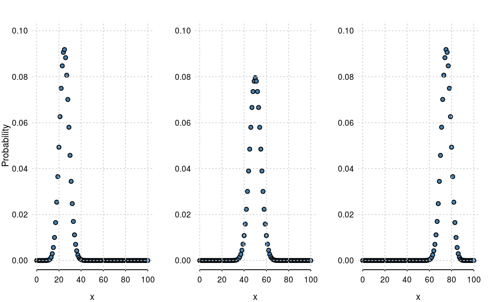
<p class="caption">(\#fig:4-1)The Binomial distribution with $n=100$ and $p =0.25$, $0.5$ and $0.75$.</p>
</div>

<!-- XXX personally really don't like the scatterplot for this, I think a bar chart would be better but obviously up to you -->

Some points to note:

 * The sum of points in each plot in figure \@ref(fig:4-1) is $1$. It's a probability mass function, so it must sum to 1.
 * The distribution is centred around the mean, $n \times p$. So when $p=0.5$, the plot is centred
 around $50$. 
 * There is _some_ variation around the mean. Again we can be more precise and state that the variance
 is $n \times p \times (1-p)$. So when $p = 0.5$, the variance is $n/4 = 100/4 = 25$
 

### Motivating example

In our example we have $n = 1000$ hard drives that fail with rate $p = 0.05$. On average we would expect $n \times p = 1000 \times 0.05 = 50$ failures per year. To obtain an upper bound, we would look at the cumulative distribution, that is,

\[
Pr(X \le k) = Pr(X = 0) + Pr(X = 1) + \ldots + Pr(X = k)
\]

<!--   * What is the probability of 0 successes; -->
<!--   * What is the probability of 1 success; -->
<!--   * What is the probability of 2 successes, etc. -->

This is easily done in R. The function `pbinom()` calculates the probability of observing less than 
or equal to the value of it's first argument. So to obtain a reasonable 
upper bound, we calculate the cumulative probability from $0$ to $1000$ and determine
where it crosses the 0.99 probability threshold

```r
n = 1000; p = 0.05
which(pbinom(0:n, n, p) > 0.99)[1]
#> [1] 68
```
Hence the probability that we observe more than $67$ failures in one year is less that 0.01.
So while the mean number of failures is 50, a reasonable upper bound would be 67.

## The Normal/Gaussian distribution

<div class="rmdnote">
<p>A number of mathematicians contributed to the development of this distribution. The distributions namesake, <a href="https://en.wikipedia.org/wiki/Carl_Friedrich_Gauss">Carl Friedrich Gauss</a> was a German mathematician who developed a number of key statistical concepts, such as least squares optimisation.</p>
</div>

The Normal distribution (or Gaussian) distribution is perhaps the most famous 
probability distribution. The previous distributions have been discrete, the Normal 
distribution is a _continuous_ distribution. It takes the form
\[
f_X(x) = \frac{1}{\sqrt{2 \pi \sigma^2}} e^{- \frac{(x - \mu)^2}{2 \sigma^2}}
\]
where 

 * $\mu$ is the mean or expectation of the distribution (and also its median and mode);
 * $\sigma$ is the standard deviation;
 * $\sigma^2$ is the variance.

The _standard_ normal distribution (figure \@ref(fig:4-2)) is a special case of the normal distribution 
where $\mu = 0$ and $\sigma = 1$
\[
f_X(x) = \frac{1}{\sqrt{2 \pi}} e^{- \frac{x^2}{2}}
\]

<div class="figure" style="text-align: center">
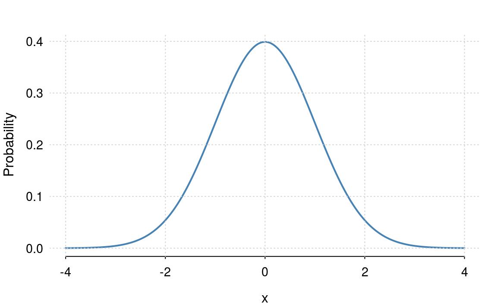
<p class="caption">(\#fig:4-2)The standard normal distribution: $\mu=0$ and $\sigma = 1$.</p>
</div>

The distribution can be derived in a variety of ways, but the easiest is as a _special_
case of the Binomial distribution. Letting $n$ get large (basically when $n > 20$), and provided
$p$ isn't too close to $0$ or $1$, the normal distribution is almost identical to the Binomial. Again, 
we can use mathematics to show that the binomial distribution _converges_ to the normal, but to 
avoid unnecessary mathematical detail, we'll just use a few plots (figure \@ref(fig:4-3)).

<div class="figure" style="text-align: center">
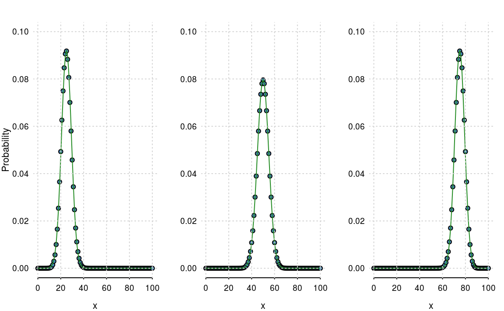
<p class="caption">(\#fig:4-3)Binomial distributions with their normal approximations.</p>
</div>

### Continuous and discrete distributions

The Binomial and Bernoulli are examples of discrete distributions. A discrete 
distribution gives you the probability of observing a particular event such as
rolling a dice or tossing a coin. For a discrete distribution, the probabilities 
will sum to $1$, e.g. we will either get a head or tail, but one of the two events must happen.

A continuous distribution is a bit different. Looking at the formula for the normal distribution 
we see that it is valid for all values of $x$. That means if we added up $f_X(x)$ for
all values of $x$, we would reach $\infty$, since $x$ has infinitely many decimal places. Instead, for continuous distributions we look
at area under the curve. So the area under the normal distribution sums (or integrates) to
one. 

### The standard deviations rule

When your data are normally distribution, then the

 * mean $\pm$ 1 standard deviation: $\simeq$ 70% of data;
 * mean $\pm$ 2 standard deviation: $\simeq$ 95% of data;
 * mean $\pm$ 3 standard deviation: $\simeq$ 99.9% of data.

This is way the mean and variance are useful summary statistics.
 
 

<!-- #### Example -->

<!-- #### Exercise / Q&A (10 minutes) -->


### The Z-Score

The $z$-score is where we transform, or scale, the dataset to have mean $0$ and variance $1$. If our original data is $x$,  then our _transformed_ data $z$ is defined as
\[
z = \frac{x - \bar x}{s}
\] 
where $\bar x$ is the mean of $x$ and $s$ is the standard deviation. The transformed data tells us how many standard deviations above or below the mean each data point is. If our data is normal, this would produce
a standard normal distribution.

This is also known as "slide and squash rule". Looking at the OKCupid data set again. 
The original distribution of ages is shown in figure \@ref(fig:4-4) a.

 * Subtract the mean, slides the distribution to $0$ - figure \@ref(fig:4-4) b.
 * Dividing by the standard deviation, squashes the distribution to have a variance of $1$ -
 figure \@ref(fig:4-4) c.

Using $Z$-scores is a standard technique to put different variables on the same scale. This also
helps many machine learning algorithms converge quicker.

<!-- XXX graph titles, also why different bin rules? -->
 
<div class="figure" style="text-align: center">
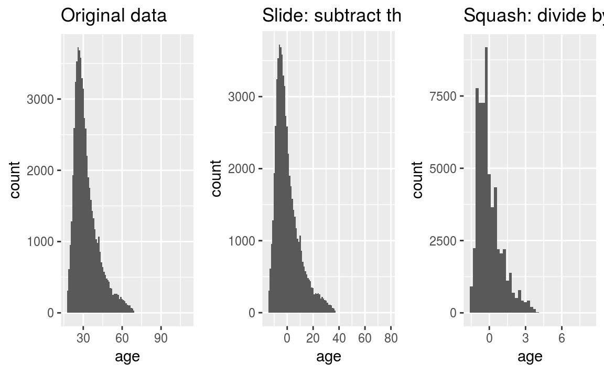
<p class="caption">(\#fig:4-4)The slide and squash rule.</p>
</div>


<!--chapter:end:04-probability.Rmd-->

---
knit: "bookdown::preview_chapter"
editor_options: 
  chunk_output_type: console
---


# Margin of Error {#chapter5}


> Testing leads to failure, and failure leads to understanding
> _Burt Rutan_

## Introduction & motativating example

Suppose we're comparing two advert designs. At great expense, it has been decided to 
change the font to Comic Sans. Does this change work? Being a (data) scientist we decide to (humanely^[Is using Comic Sans humane? Discuss.]) experiment on people by randomly showing them the advert. From 
past experience, you know that customers spent 45 seconds (on average) on your site. 
After switching to comic sans, we recorded the amount of time spent on the site
by 20 customers

```
34 51 30 79 54 31 57 62 59 41 77 55 35  3 69 46 47 66 63 59
```
Should we consider switching to comic sans?

Clearly time will vary visit–by–visit. On some visits, customers might spent more time (up to
79 seconds), but on others visits, they may only spend a few seconds. To get
an overall impression, we could work out the average time for the above sample
\[
\bar x = \frac{34 + 51 + 30 + \ldots + 59}{20} = 50.9
\]
The new website does seem to be perform slightly better. But we have a very small sample. If
we took another twenty visits, we would get a different estimate. We need to account for this
sampling variability of the mean $\bar x$, and the most common way of doing this is to perform a
hypothesis test.


## One sample test

The one–sample z–test can be useful when we are interested in how the mean of a set of sample
observations compares to some target value. The mean in our sample, as always, is denoted by
$\bar x$. The standard notation in statistics for the population mean is the Greek symbol $\mu$
(pronounced “mu”). Obviously, $\bar x$ is our sample estimate of $\mu$.

In the example above, we'd like to know whether our new font has affected the amount of time 
people spend on our site. In hypothesis testing, we make this assertion in the null hypothesis, 
denoted by $H_0$ and often written down as
\[
H_0: \mu = 45
\]
We usually test against a general alternative hypothesis $H_1$
\[
H_1: \mu \ne 45
\]
which says "$\mu$ is not equal to 45".

When performing the hypothesis test, we _assume_ $H_0$ to be true. We then ask ourselves the
question:

> How likely is it that we would observe the data we have, or 
> indeed anything more extreme than this, if the null hypothesis is true?

We can get a handle on this question thanks to the Central Limit Theorem in Statistics.
Although we will not go into the details here, this result tells us that the quantity
\[
Z = \frac{\bar x - \mu}{s/\sqrt{n}}
\]
follows a normal distribution (when $n$ is reasonably large). In this formula

  * $\bar x$ is our sample mean;
  * $\mu$ is the assumed value of the population mean under the null hypothesis $H_0$;
  * $s$ is the sample standard deviation;
  * $n$ is the sample size.


<div class="rmdnote">
<p>When <span class="math inline">\(n\)</span> is small, the central limit theorem tells us that <span class="math inline">\(Z\)</span> follows a <span class="math inline">\(t\)</span>-distribution. A <span class="math inline">\(t\)</span> distribution is similar to the normal, except it has fatter tails (imagine pushing down on the normal distribution and spreading the weight). Provided your sample is large (<span class="math inline">\(n &gt; 10\)</span>), then the <span class="math inline">\(z\)</span> and <span class="math inline">\(t\)</span> tests are equivalent.</p>
</div>

Using our example data set, if the null hypothesis is true, then $\mu = 45$, so we 
have
\[
Z = \frac{\bar x - \mu}{s/\sqrt{n}} = \frac{50.9 - 45}{18.2/\sqrt{20}} = 1.45
\]
The obvious question is, how likely is it to have observed this value?

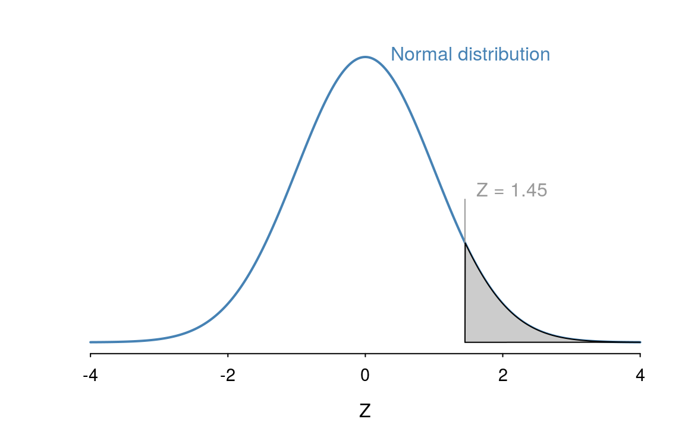

Since the normal distribution is symmetric, $Z = 1.45$ is just as extreme as $Z = −1.45$, 
and so the shaded region in the following diagram illustrates the $p$–value - 
the probability of observing the data we have, 
or anything more extreme than this, if the null hypothesis is true. In other words,
the answer to our earlier question!

The closer the area of the shaded region (the $p$–value) is to 0, the less plausible it is that we
would observe the data we have if the null hypothesis is true, that is, the more evidence we have
to reject $H_0$. 
So, we need to work out the area of the shaded region under the curve in the
diagram above, which can be done using R

```r
pnorm(1.45, lower.tail = FALSE) * 2
#> [1] 0.147
```
So the $p$-value is 0.15.

Earlier, we said that the smaller this $p$–value is, the more evidence we have to reject $H_0$. 
The question now, is:

> What constitutes a p–value small enough to reject H_0?

The convention (but by no means a hard–and–fast cut–off) is to reject $H_0$ if the p–value is
smaller than 5%. Thus, here we would say:

  * Our p–value is greater than 5% (in fact, it’s larger than 10% – a computer
can tell us that it’s exactly 14.7%)
  * Thus, we do not reject $H_0$
  * There is insufficient evidence to suggest a real deviation from the previous value
  
Care should be taken not be too strong in our conclusions. We can only really state that
the sample does not suggest that the new design is better.

> Absence of evidence is not evidence of absence

To perform the entire procedure in R, we use the `t.test()` function

```r
comic = c(34, 51, 30, 79, 54, 31, 57, 62, 59, 41, 77, 55, 35, 3, 69, 46, 47, 66, 63, 59)
t.test(comic, mu = 45)
#> 
#> 	One Sample t-test
#> 
#> data:  comic
#> t = 1, df = 20, p-value = 0.2
#> alternative hypothesis: true mean is not equal to 45
#> 95 percent confidence interval:
#>  42.4 59.4
#> sample estimates:
#> mean of x 
#>      50.9
```
Technically this
is performing a t-test which is why the associated $p$-value is slightly larger than
our calculation. However, when the sample size is large, the `t.test()` function is equivalent to a z-test.

### Example: OKCupid

The OKCupid dataset provides heights of their users. An interesting question is,
how consistent are the heights given by users with the average height across the USA?
First we need to extract the necessary information. R makes subsetting straightforward


```r
## Select Males
height = cupid$height[cupid$sex == "m"]
## Remove missing values
height = height[!is.na(height)]
## Convert to cm
height = height * 2.54
mean(height)
#> [1] 179
```
From the [CDC](https://www.cdc.gov/nchs/data/series/sr_11/sr11_252.pdf) paper
we discover the average height in the USA is 69.3 inches. We can use the $t$-test function in R 
(since the sample size is large, this is equivalent to a $z$-test), to obtain 
a $p$-value


```r
t.test(height, mu = 69.3)
#> 
#> 	One Sample t-test
#> 
#> data:  height
#> t = 3000, df = 40000, p-value <2e-16
#> alternative hypothesis: true mean is not equal to 69.3
#> 95 percent confidence interval:
#>  179 179
#> sample estimates:
#> mean of x 
#>       179
```
Since the $p$-value is small, we reject $H_0$ and conclude that the sample gives evidence that 
males in San Francisco are different to the rest of the USA (or just lie!).


### Errors

A Type I Error occurs when the null hypothesis is true but is wrongly rejected. This often
referred to as a "false hit"", or a false positive (e.g. when a diagnostic test indicates the presence
of a disease, when in fact the patient does not have the disease).

The rate of a Type I Error is known as the size of the test and is usually denoted by the Greek
symbol $\alpha$, pronounced "alpha", and usually equals the significance level of the test - that is, the
p–value beyond which we have decided to reject H 0 (e.g. 5% or 0.05 in our earlier examples).

A Type II Error occurs when the null hypothesis is false, but erroneously fails to be rejected.
Hence, we fail to assert what is present, and so this is often referred to as a ‘miss’.
The rate of the Type II Error is usually denoted by the Greek symbol $\beta$, pronounced “beta”,
and is related to the power of a test (which equals 1 − $\beta$).


## Two sample z-test

Suppose we want to test another improvement to our website. We think that adding
a [blink](https://en.wikipedia.org/wiki/Blink_element) tag would be a good way of
attracting customers. Monitoring the first twenty customers we get

```
21 32 46 19 29 31 37 28 50 29 34 40 26 20 48  7 39 30 40 34
```

How do we compare the website that uses the Comic Sans font to the blinking site? We use a two sampled z-test! 
As with the one–sample test, we must start by setting up our hypotheses. In a two–sample z
test, the null hypothesis is always that the population means for the two groups are the same
\[
H_0: \mu_1 = \mu_2
\]
While the alternative hypothesis is that the two pages differ, i.e.
\[
H_1: \mu_1 \ne  \mu_2.
\]
The corresponding test statistic is
\[
Z = \frac{\bar x_1 - \bar x_2}{s \sqrt{1/n_1 + 1/n_2}}.
\]
This time we will jump straight into R and use the `t.test()` function. 

```r
blink = c(21, 32, 46, 19, 29, 31, 37, 28, 50, 29, 34, 40, 26, 20, 48, 7, 39, 30, 40, 34)
t.test(comic, blink, var.equal = TRUE)
#> 
#> 	Two Sample t-test
#> 
#> data:  comic and blink
#> t = 4, df = 40, p-value = 3e-04
#> alternative hypothesis: true difference in means is not equal to 0
#> 95 percent confidence interval:
#>   9.37 28.43
#> sample estimates:
#> mean of x mean of y 
#>      50.9      32.0
```
In this example, since the p-value is relatively, we can conclude that the two
web-designs do appear to be different. 


## Confidence intervals

The idea of a confidence interval is central to statistics. When we get an answer, 
we don't just want a point estimate, i.e. a single number, we want a plausible
range. In fact whenever you see opinion polls in newspapers, they typically come 
with a margin of error of $\pm 3$%. It's always amusing to see the fuss that people 
make when an opinion poll raises by 1% which is likely to be down to random noise.

Confidence intervals provide an alternative to hypothesis tests for assessing questions about the
population mean (or population means in two sample problems), although often they are used
alongside hypothesis tests. Due to lack of time, we will not cover the general theory supporting
the construction of confidence intervals, although this theory is the same as that discussed in
Section 4 for hypothesis tests and revolves around the Central Limit Theorem. The aim is to use
the information in our sample to obtain an interval within which we might expect the true
population mean to lie, with a specified level of confidence.

Recall that the sample mean $\bar x$ is an estimate of the population mean $\mu$. The
population mean does exist; we’d like to know what it is, but usually this isn't possible (unless
we are able to take a census). The next best thing is to take a sample from the population and
find $\bar x$ - if our sample is representative of the population as a whole, we might feel confident that
$\bar x$ is a good estimator for $\mu$, and might be close to the true value.

The problem is, if we were to take many samples from the population, and so calculate many $\bar x$'s, they are all likely to be different to each other.  Which one would we trust the most?  In reality, we don't have the resources to take many samples, and so we'd like a way of capturing the variability of $\bar x $ based on the information in our single sample.  This is where statistical theory can help us out!

Central to the idea of margin of error, is the [_central limit theorem_](https://en.wikipedia.org/wiki/Central_limit_theorem).


### Construction

Most confidence intervals are symmetric and two--sided.  Thus, to obtain a confidence interval for the population mean we:

1. Find the mean in our sample, $\bar x$
1. Subtract some amount from $\bar x$ to obtain the _lower bound_ of our confidence interval
1. Add the same amount in (2) to our sample mean $\bar x$ to obtain the _upper bound_ of our confidence interval

The amount we add and subtract from $\bar x$ is a function of the sample standard deviation $s$ and the sample size $n$; it also depends on just how "confident"" we want to be of capturing the population mean $\mu$ within our interval!  To be 100\% confident, the lower and upper bounds would need to extend to the smallest and largest values possible for our random variable, and so it makes no sense to find such an interval; the standard is to find a _95% confidence interval_.

The formula for a symmetric, two--sided 95% confidence interval for the population mean $\mu$ is
\[
\left(\bar{x}-z \times \frac{s}{\sqrt{n}}, \hspace{0.5cm} \bar{x}+z\times \frac{s}{\sqrt{n}}\right),
\]
often condensed to just
\[
\bar{x} \pm z \times \frac{s}{\sqrt{n}};
\]
where $z$ is a critical value from the standard normal distribution. For the standard interval 95% 
confidence interval, the $z$ value is 1.96, often rounded to 2. So the interval becomes
\[
\bar{x} \pm \frac{2 s}{\sqrt{n}}.
\]
If we wanted a 90% interval, we would use $z = 1.645$. For a 99% interval, we would use
$z = 2.576$

### Example: Comic Sans

Let's return to our Comics Sans example. The average time spent on the site was $\bar x = 50.9$ with
a standard deviation of $s = 18.2$. This gives a 95% confidence interval of
\[
50.9 \pm 1.96 \frac{18.2}{\sqrt{20}} = (42.92, 58.88).
\]
Alternatively, we could use R and extract the confidence interval from

```r
t.test(comic)
#> 
#> 	One Sample t-test
#> 
#> data:  comic
#> t = 10, df = 20, p-value = 1e-10
#> alternative hypothesis: true mean is not equal to 0
#> 95 percent confidence interval:
#>  42.4 59.4
#> sample estimates:
#> mean of x 
#>      50.9
```
to get the interval $(42.38,59.42)$. Notice this interval is slightly wider, since it's using the
exact $t$-distribution.


## The Central Limit Therem (CLT)

<!-- XXX That have finite mean and variance -->

One of the reasons the normal distribution is so useful is the central limit theorem. 
This theorem states that if we average a large number (say 30^[Puts big data into perspective!]) of variables^[The key phrase is independent and
identically distributed random variables.], then the result is approximately normally distributed.

So if we observe data, $x_1, x_2, \ldots, x_n$,  where the mean and variance of $x_i$ are $\mu$ and $\sigma^2$, then
\[
S_n = \frac{x_1 + x_2 + \ldots + x_n}{n}
\]
has a normal distribution with mean $\mu$ and variance $\sigma^2/n$. 

The standard error of the mean is defined as the standard deviation of the sample mean, i.e.
$\sigma/\sqrt{n}$. Remember that $\sigma$ is the population standard deviation, so we _estimate_ the
standard error using $s/\sqrt{n}$

<!-- XXX think this note reads funny, but struggling to think of what I would put -->

### Example: Customer waiting times

<div class="figure" style="text-align: center">
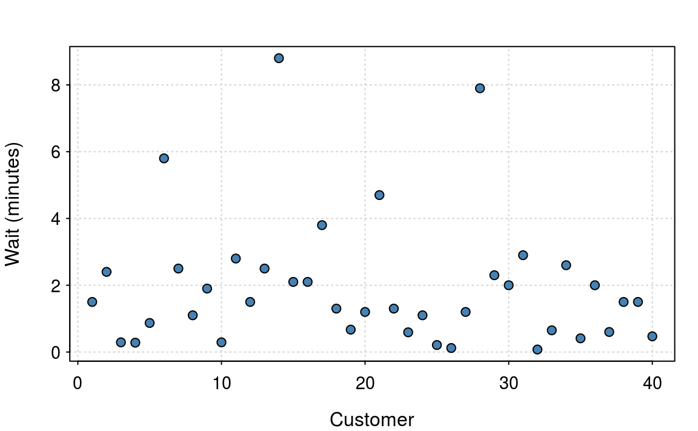
<p class="caption">(\#fig:5-2)Waiting times from 40 customers. The data is skewed and is not normally distributed.</p>
</div>

<!-- XXX might be easier to see if you had a histogram next to it? -->

Figure \@ref(fig:5-2) shows the waiting time (in minutes) of
$40$ customers. The figure shows that the average wait is around 1 to 2 minutes, but some unfortunate 
customers have a significantly longer wait. The data 
are clearly not normal, as waiting times must be positive and the distribution isn't symmetric.
 
From chapter 2, we can quickly estimate the mean and standard deviation as 1.946 and 0.433, i.e. $S_n = 1.946$ . The CLT allows us to take this inference one step further. Since we know that $S_n$ is approximately normal, that implies
that with probability 95%, the true mean lies between $2.19 \pm 2 \times 2.04/20 = (1.28, 3.1).$

<div class="rmdwarning">
<p>Mathematically the central limit theorem only holds as <span class="math inline">\(n\)</span> tends to infinity. However in this simple example, the underlying distribution is clearly not normal, so the confidence interval, given our finite sample, isn't actually 95%, it's more like 91%. Which is still not too bad.</p>
</div>


The central limit theorem is a powerful idea. It allows to get a handle on the uncertainty
whenever we estimate means. One word of warning though. If the distribution is particularly odd, 
then we'll need a larger sample size for the normality approximation to be accurate.


<!--chapter:end:05-margin-of-error.Rmd-->

---
output: html_document
editor_options: 
  chunk_output_type: console
---

# Capturing relationships with linear regression {#chapter6}
<!-- (90 minutes) -->

In many data science problems, we wish to use information about some variables
to help predict the outcome of another variable. For example, in banking, we 
might wish to use a persons financial history to predict the likelihood of them defaulting
on a mortgage. The idea of using past data to predict future events is central 
to data science and statistics. 


The simplest relationship between two variables is linear. The 
correlation coefficient will provide a single number summary of this relationship.
To use the linear interaction for prediction, we need to use linear regression techniques.
In our final chapter, we will look at standard modelling techniques.  
We'll start with the simplest measure, correlation, before moving onto linear regression models.


## Capturing linear relationships

The easiest way to quantify the relationship between two variables is to calculate the
correlation coefficient. This is a measure of the _linear_ association. The sample correlation
coefficient is defined as
\[
r=\frac {\sum _{i=1}^{n}(x_{i}-{\bar {x}})(y_{i}-{\bar {y}})}{{\sqrt {\sum _{i=1}^{n}(x_{i}-{\bar {x}})^{2}}}{\sqrt {\sum _{i=1}^{n}(y_{i}-{\bar {y}})^{2}}}}
\]
where

 * $n$ is the sample size;.
 * $x_{i},y_{i}$ are the single samples indexed with $i$.
 * $\bar {x} = \frac {1}{n} \sum _{i=1}^{n} x_{i}$ is the  (the sample mean).

The value of $r$ lies between $-1$ and $1$. A value of $1$ implies that all
data points lie on a line as $X$ and $Y$ increase. A values of $-1$ implies that 
all data points lie on a line where $Y$ decreases as $X$ increases. 
A value of 0 implies that there is no linear correlation between the variables.

(ref:6-1) Several sets of (x, y) points, with the correlation coefficient of x and y for each set. Credit: [Wikipedia](https://en.wikipedia.org/wiki/Correlation_and_dependence)

<div class="figure" style="text-align: center">
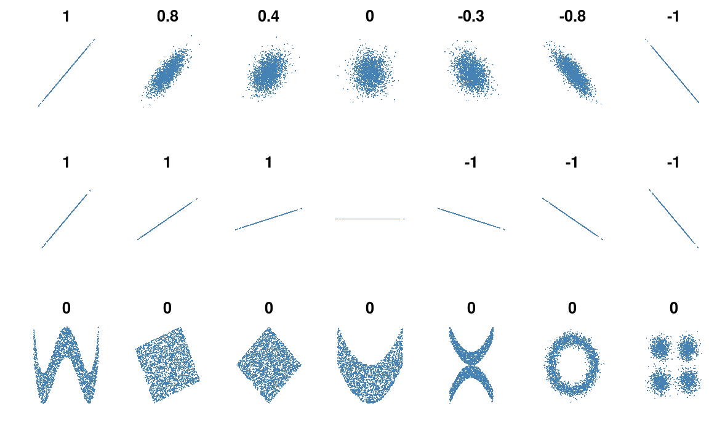
<p class="caption">(\#fig:6-1)(ref:6-1)</p>
</div>


Figure \@ref(fig:6-1) (shamelessly stolen from wikipedia) gives a very useful overview 
of the correlation coefficient. The top row of plot shows how data changes as we
move from a coefficient of $+1$ to $-1$. When $r = 0$, we just have random scatter.

Something that is often forgotten, is that correlation _does not_ measure the strength 
of the linear association. This is clear from the second row of figure \@ref(fig:6-1)
where it is clear that the correlation does not depend on the gradient.

The final row of figure \@ref(fig:6-1) shows figures where the correlation cofficient
is 0. However, in each example there is clearly a relationship; it's just not linear.

<div class="rmdnote">
<p>Calculating the correlation is a useful first step when you first come across a data set. My typical first step is to run <code>image(cor(data_set))</code>. This produces a very ugly, but informative heatmap of the correlation cofficients.</p>
</div>


### Example: Starbucks calorie content

The Starbucks data set contains nutritional value of 113 items. 
For each item on the menu we have the number of calories, and the carbohydrate, fat, fiber and protein
amount. 


We can quickly get an overview in R, 


```r
head(starbucks)
#>                                  Product Calories Fat Carb Fiber Protein
#> 1                           Chonga Bagel      300   5   50     3      12
#> 2                           8-Grain Roll      380   6   70     7      10
#> 3                       Almond Croissant      410  22   45     3      10
#> 4                          Apple Fritter      460  23   56     2       7
#> 5                       Banana Nut Bread      420  22   52     2       6
#> 6 Blueberry Muffin with Yogurt and Honey      380  16   53     1       6
```
and generate a few scatter plots \@ref(fig:6-2).
<div class="figure" style="text-align: center">
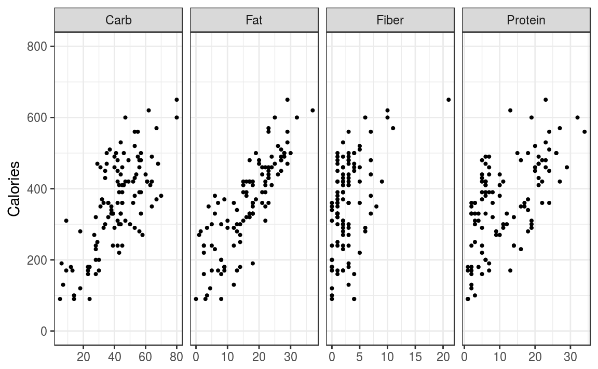
<p class="caption">(\#fig:6-2)Relationships of Calories content and ingredients.</p>
</div>
The scatter plots show a clear linear trend. To work out the sample pairwise
correlations we use the `cor()` function

```r
## Drop the first column since it's the food names
cor(starbucks[, -1])
#>          Calories   Fat  Carb Fiber Protein
#> Calories    1.000 0.829 0.708 0.471   0.619
#> Fat         0.829 1.000 0.281 0.276   0.423
#> Carb        0.708 0.281 1.000 0.408   0.204
#> Fiber       0.471 0.276 0.408 1.000   0.472
#> Protein     0.619 0.423 0.204 0.472   1.000
```
The R output returns all pairwise correlations between the 5 variables:

 * There is a diagonal of 1, since the correlation of a variable with itself is 1.
 * The matrix is _symmetric_ since the correlation between $X$ and $Y$ is the same
 as the correlation between $Y$ and $X$.

Out of the four component parts, `Fat` is very highly correlated with `Calories`.
 
## Linear Regression

The next step is use information about one variable to inform you about another. 
If you recall back to your school days, you'll hopefully remember that the
equation of a straight line is
\[
Y = \beta_0 + \beta_1 x
\]
where 

  * $\beta_0$ is the $y$-intercept (in the UK, we used $c$ instead of $\beta_0$);
  * $\beta_1$ is the gradient (in the UK, we used $m$ instead of $\beta_1$).
  
In statistics, we usually call $Y$ the response variable (the thing we want to predict) 
and $x$ the predictor (or covariate). The aim of the model is to estimate the
values of $\beta_0$ and $\beta_1$. However, since we only have a sample, there is uncertainity
surrounding our estimate.

To fit the model in R, we use the `lm()`^[`lm` is short of linear model; this model is _linear_ in the 
model coefficients.] function


```r
# This is an R formula
# Read as: Calories is modeled by Fat
(m = lm(Calories ~ Fat, data = starbucks))
#> 
#> Call:
#> lm(formula = Calories ~ Fat, data = starbucks)
#> 
#> Coefficients:
#> (Intercept)          Fat  
#>       148.0         12.8
```
The output from R gives estimates of $\beta_0 = 148.0$ and $\beta_1 = 12.8$.

### Prediction and Interpretation 

The estimated model,
\[
\text{Calories} = 148 + 12.8 \times \text{Fat}
\]
allows us to predict the calorie content based on the fat. For example, if the fat content
was 10, then the estimated calorie content would be 276. However this simple example also 
highlights the potential dangers of using the model for prediction. If we wished to predict the
calorie content of fat-free food, i.e. $\text{Fat} = 0$, then our model would estimate the calorie
content as $148$. This seems a bit high for a glass of water! The obvious reason for this 
poor fit is that our model isn't capturing our aspects of the relationship or is missing 
other significant covariates.

### How do we estimate the model coefficients?

We estimate the model parameters by "minimising the sum of squared residuals". A
residual is the difference between the observed value and the predicted 
value. In figure \@ref(fig:6-3), the observed values, i.e. the data, are the
black dots and the residuals are the solid lines. The line of best fit is the dashed line.
In figure \@ref(fig:6-3) we have five data points, so we must have five residuals. 

The classical _statistics interpretation_ of a linear regression model is to assume the
underlying model is actually
\[
Y = \beta_0 + \beta_1 x + \epsilon
\]
where $\epsilon$ is normally distributed. If assume that the errors ($\epsilon$) follow
a normal distribution, then to estimate the parameter values we minimise the sum of squared 
residuals. 

<div class="figure" style="text-align: center">
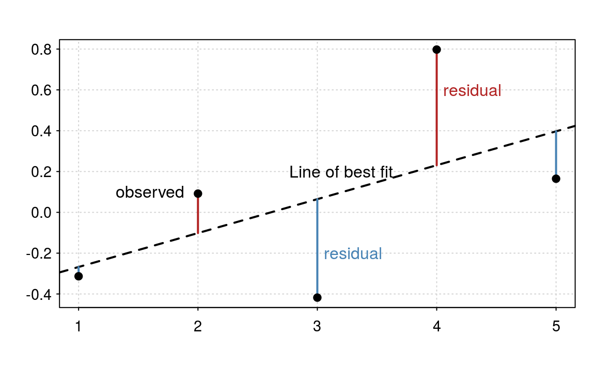
<p class="caption">(\#fig:6-3)Residuals and linear regression.</p>
</div>

The _machine learning_ interpretation is that we have a cost function that we wish to minimise. 
It just so happens that in this particular case, that the cost function corresponds to 
assuming normality. But we could have used any cost function. To assess model fit, 
we would typically use [Cross validation](https://en.wikipedia.org/wiki/Cross-validation_(statistics))
or a similar method.

One approach isn't better than the other. The statistics approach gives more insight 
into the mechanisms, but the _machine learning_ approach leads to a better predictive model.
As in most cases, a combination of both methods is the optimal approach.

## Multiple linear regression models

A multiple linear regression model is the natural extension of the simple linear 
regression model. If we have two predictors, e.g.
\[
Y = \beta_0 + \beta_1 \text{Fat} + \beta_2 \text{Carb}
\]
This is equivalent to fitting a plane (a sheet of paper) through the points (figure \@ref(fig:6-4)).

<div class="figure" style="text-align: center">
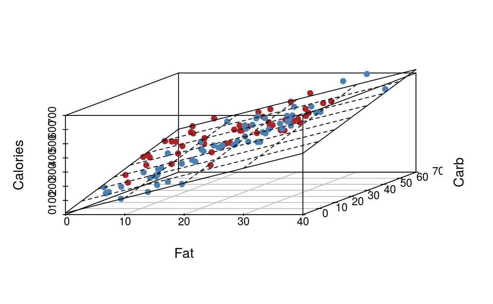
<p class="caption">(\#fig:6-4)Illustration of multiple linear regression with two predictor variables.</p>
</div>
When we have more than two predictor variables, the geometric interpretation 
gets messy, but it's still the same idea.

The parameter estimating procedure is identical to simple linear regression - we wish to minimise
the sum of squared residuals. Furthermore, we still have the two views of the model: the 
statistical and machine learning.

Fitting the model in R is a simple extension


```r
(m = lm(Calories ~ Fat + Carb, data = starbucks))
#> 
#> Call:
#> lm(formula = Calories ~ Fat + Carb, data = starbucks)
#> 
#> Coefficients:
#> (Intercept)          Fat         Carb  
#>       11.36        10.52         4.17
```
Notice that the coefficient  for `Fat` has decreased from 12.8 to 10.52 due to the influence
of the Carbohydrate component.

<!-- Correlation: linear relationship between two variables -->
<!-- Examples -->
<!-- Exercise / Q&A -->
<!-- Simple linear regression -->
<!-- Assumptions -->
<!-- Residuals: Observed - expected -->
<!-- Examples -->
<!-- Exercise / Q&A -->


<!--chapter:end:06-regression.Rmd-->


# Wrap-up {#chapter7}

<!-- Weak-->
The goal of this short book is provide a short introduction into 
the wonderful world of data science, from a statistics view point. 
Using the simplest of statistical techniques, from summary statistics to 
graphics, we can highlight unusual and interesting patterns in our data.
These techniques lay the analysis foundations for more advanced techniques.

<!--chapter:end:07-wrap-up.Rmd-->

